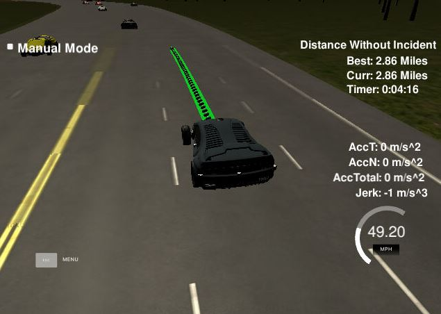
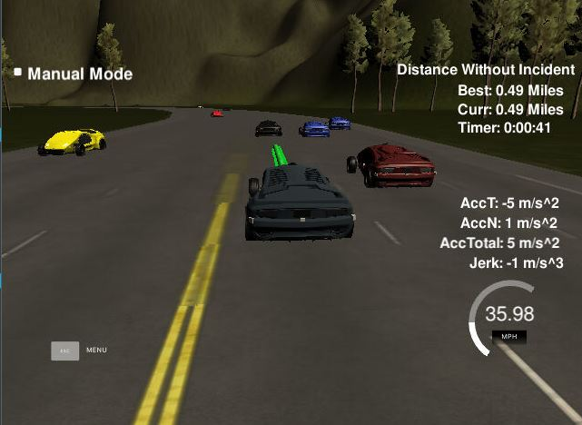
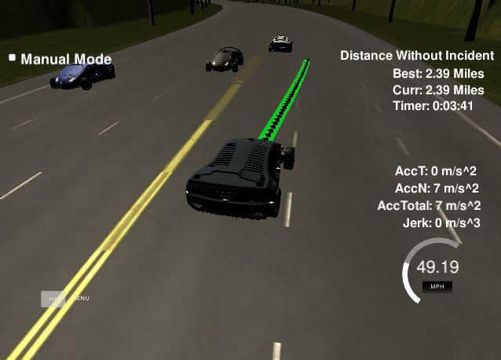

# CarND-Path-Planning-Project
Self-Driving Car Engineer Nanodegree Program
   
### Overview
This is a summary of my code for the Path Planning Project for the Udacity Self-Driving Car Engineer Nanodegree Program. For this project, we were to design a path planner that is able to create a smooth and safe path for a car in a simulated three lane highway. The main criteria were to make sure to follow the speed limit, avoid collisions, and maintain a comfortable acceleration / jerk. 

### Initialization
We begin with the localization of the car's data which is given as a template, using a Frenet coordinate system. All other vehicles are read in using sensor fusion. Max velocity was set to 49 mph and max acceleraiton was set to 0.224. 

### Path (Speed and Acceleration)

For the generic path of the car, we use a spline methodology. We start by creating reference points using (x,y) coordinates and a path vector. Waypoints are created with the following code. For our purposes, we are using 30m apart. We also decided to start the car in the middle lane. In Frenet coordinates, d which is the lateral value, was assigned in the following way. 0 to 4 was the left lane, 4 to 8 was the middle lane, and 8 to 12 was the right most lane. 

```shell
vector<double> next_wp0 = getXY(car_s + 30, 2 + 4*lane, map_waypoints_s, map_waypoints_x, map_waypoints_y); 
vector<double> next_wp1 = getXY(car_s + 60, 2 + 4*lane, map_waypoints_s, map_waypoints_x, map_waypoints_y);
vector<double> next_wp2 = getXY(car_s + 90, 2 + 4*lane, map_waypoints_s, map_waypoints_x, map_waypoints_y);
```
The spline is then used to smooth our the path between these waypoints as they are pushed into the path vector. To not have to regenerate the path each time, we simply push the previous points generated (unless at the beginning). A size of 50 was chosen as it seemed to be enough for the car to make adjustments if something were to suddently to change. 



Through this process, the car was able to simply stay in a single lane smoothly as seen in the picture above. 

### Lane Changes / Avoid Collisions
Clearly, we cannot just stay in the same lane moving at the same speed otherwise would collide into other cars. The car will check if there are cars ahead of it, and go through a process to check whether it should change lanes or slow down. 



To efficiently move through the highway, we need to be able to change lanes. We check through the sensor fusion data to check if there are any cars within our lane, left, and right lane. 

```shell
           if ( car_ahead ) { 
              if ( !car_left && lane > 0 ) { // change lane left if there is no car in the left lane
                lane--; 
              } else if ( !car_right && lane != 2 ){ //  change lane right if there is no car in the right lane
                lane++;
              } else {
                change_speed -= max_a; // slowdown if cannot change lanes
              }
            } else {
              if ( ref_vel < max_s ) {
                change_speed += max_a; // speed up by max acceleration if under speed limit if no cars in current lane
              }
            }
```



If there is a vehicle ahead of it, the code will check if there is a lane clear (no car in the left or right lane) and make a decision to change lanes. If there are other vehicles in either lane, the vehicle will continually slow down as appropriate. In a similar fashion, the car will accelerate untll it reaches the speed limit if there are no vehicles ahead of it. 


### Conclusion
Through this code, the car is able to navigate indefinitely through the highway simulation regardless of what the other vehicles in the simulation are doing in an efficient manner. The car is able to slowdown to avoid other vehicles, speed up when it has space, and change lanes to find more space. 


